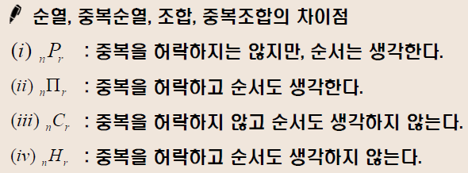

확률

발생빈도주의 : 주사위의 숫자가 똑같이 확률로 나올 것이라고 전제함.  확률 밀도함수에 의해 표현됨. 

베이즈확률론 : 주어진 증거 혹은 주어지지 않은 상태. 개인의 믿음의 정도(과거에 시행했던 경험을 토대로). 주사위를 던질때마다 확률이 변할 것이다. 매 시행 시 확률 변함. 측정을 통해 파악만 할 것이다. 우연적 탐색을 시도함. 

믿음의 정도는 다양하게 나타남. 그렇기 때문에 슈뢰딩거의 방정식으로 표현함.

슈뢰딩거의 고양이 : 관찰자의 행위 자체가 피관찰자의 결과를 바꿈?

 									내 행위가 빛의 운동량을 변화시키기 때문? 

​										내가 관찰한 순간 빛의 원자를 다른데로 이동 시켰기 때문에 예측하기 어렵다.

P(y) : 믿음의 정도. 

이 때 P 는 priority. 

예 : 폐 ct 사진. 머신(인풋, 참값 알려줌. ) 패턴 학습. 이런 사진 많이 나오면 암일 확률/아닌 확률 계산.

딥러닝 , 많은 사진 모델에게 보여줌. 

P(X|어떤방법) ->패턴. 어떤방법으로 시행을 했는지에 따라 확률X가 변함. 

-----------------

P(X) 

-----------------------

통계 

어떤 숫자를 일정 체계 안에서 기록 

--------

경우의 수 

합의 법칙. 두 사건 A,B가 동시에 일어나지 않을 때, 

A또는 B가 일어나는 경우의 수는 m+n

곱의 법칙. 동시에 일어나는 경우.  한 사건 A가 m가지로 일어나고, 다른 사건 B가 n가지로 일어남. 

A와 B가 동시에 일어나는 경우의 수. Mxn

순열. 

3개에서 2개를 택해서 순서대로 나열. 

서로 다른 n개 에서 r개를 택하여 일렬로 나열하는 방법 nPr

조합.

순열의 점화식. 

1,2,3,4,5

1을 빼고 생각. 4개 있음.

4개중에서 3개 뽑아서 일렬로 나열.

nPr = Nn-1Pr-1

원순열

네트워크. 서로 다른 n개 원소 원형으로 배열. 원순ㅇㅕㄹ.

이를 계산 방법 (n-1)!

조합의 점화식.

중복조합.

서로 다른 n개에서 중복을 허락하여 r개를 택하는 조합. 

과일가게. 박스.사과,배,토마토. 구분없이 한 개 백원. 

막 골라서 500원어치 사오라고 함. 

확률에 관한 여러 용어 정리
시행 : 동일한 조건에서 여러 차례 반복할 수 있는 실험이나 관찰.
표본공간(S) : 어떤 시행에서 일어날 수 있는 모든 가능한 결과의 전체집합
사건(A) : 표본공간의 부분집합
전사건(U) : 표본공간 자신의 집합 (**반드시 일어나는 사건**)
공사건(Ф) : 결코 일어나지 않는 사건 예. 주사위 10보다 이상의 수가 나오는 경우는 없다. 
합사건 : A 또는 B 가 일어날 사건
곱사건 : A 와 B 가 동시에 일어날 사건
배반사건 : 두 사건 인 A 와 B 를 서로 배반사건이라 한다.
여사건 : 사건 A 에 대하여 A가 일어나지 않는 사건을 A의 여사건 이
라 한다.

수학적 확률.

통계적 확률. 

조건부 확률 .

A 사건이 발생했는데 그 속에서 B의 사건이 발생할 확률.

2의 배수 나오는데, 3의 배수가 나올 확률 . 

